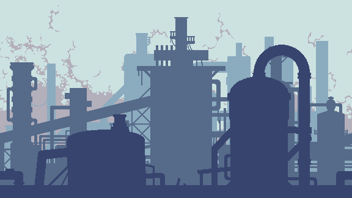

# Godot 2D : Background Parallax Animation

## Purpose

Example of a Parallax background.
You can use this Github repository for your own games.

## This template includes

An parallax background animation using handler using [Parallax Animation](https://docs.godotengine.org/en/stable/classes/class_parallaxbackground.html)

The `Level scene` to test the background animation.

The `Player scene` including its animations. For the player animation check this [repository](https://github.com/Stud-Io-Games/Godot-2D-Player-Animation)

## Setup

Clone or download this repository and open it with Godot.
Before you run the project, you'll have to configure the user inputs for your game:

To create inputs for "move_right", "move_left", "jump", "attack" > go to `Project > Project Setting > Input Map`

## Resources

I used [FREE STREET ANIMAL PIXEL ART ASSET PACK](https://craftpix.net/freebies/free-street-animal-pixel-art-asset-pack/) from [Craftpix](https://craftpix.net/).

I used [FREE INDUSTRIAL ZONE TILESET PIXEL ART](https://craftpix.net/freebies/free-industrial-zone-tileset-pixel-art/) from [Craftpix](https://craftpix.net/).

## Useful informations 

Using the above background I had some trouble loading the background correctly once the game is started. Therefore to fix it I double the size of each background assets to let the background load while the player is moving. 

